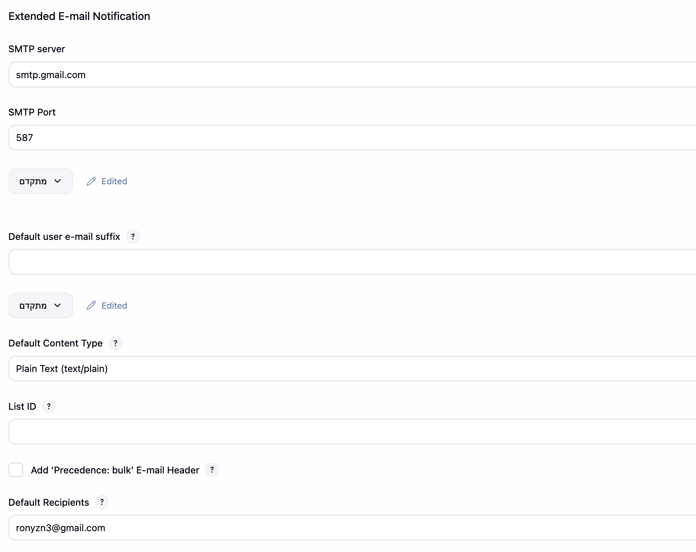
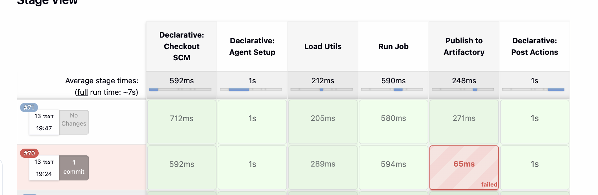
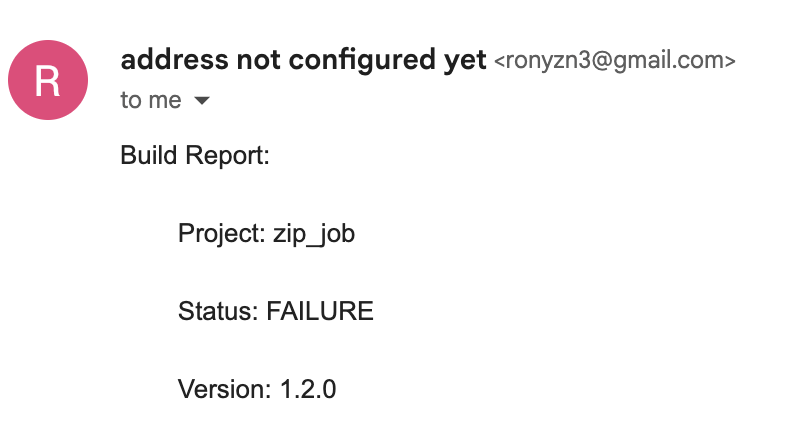
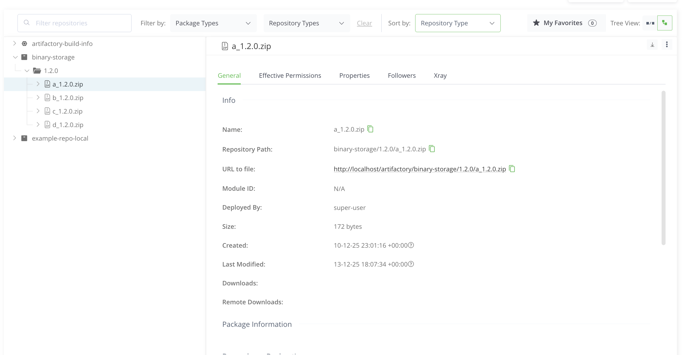

### jenkins command
```bash
docker run -p 8080:8080 -v jenkins_home:/var/jenkins_home -d jenkins/jenkins:lts
```

### create a docker to allow jenkins building dockers
``` bash
docker run \            
  --name jenkins-docker \
  --rm \
  --detach \
  --privileged \
  --network jenkins \
  --network-alias docker \
  --env DOCKER_TLS_CERTDIR=/certs \
  --volume jenkins-docker-certs:/certs/client \
  --volume jenkins-data:/var/jenkins_home \
  --publish 2376:2376 \
  docker:dind
```


# 🧩 Jenkins & Artifactory Automation Pipeline

## 📖 Overview

This project demonstrates a fully automated CI/CD pipeline using **Jenkins**, **Docker**, and **JFrog Artifactory**.
The pipeline builds a Docker image, runs a Python job that generates ZIP files, uploads them to Artifactory,
and sends aמ email report of the build results — all running inside containerized environments.

---

## Step 1: Setting up Jenkins and Artifactory in Docker

Both Jenkins and artifactory where run on two saperate containers with proper external ports defined 

Then on Jenkins the following plugins where installed:
   * **Docker Pipeline**
   * **Email Extension Plugin**
   * **JFrog Artifactory Plugin**

Included below is the configuration for each plugin:
* **Agent configuration:**

* **Artifactory:**

* **Email:**


---

##Jenkins Pipelines
both of the declerative and scripted jenkinsfiles were decoupled from the inner functionallity and only loaded the different functions frone the jenkins_utils file

###Build screenshots

**Failed build notification**

**Successful build notification**

**Files uploaded to Artifactory**


---
## Key Features

* Fully containerized Jenkins and Artifactory setup
* Automatic Docker build & execution using Jenkins pipeline
* Uploading artifacts to JFrog Artifactory via REST API
* Email reporting for every build (success or failure)
* Clean workspace after each run
* Modular design (Groovy utilities for logic separation)
